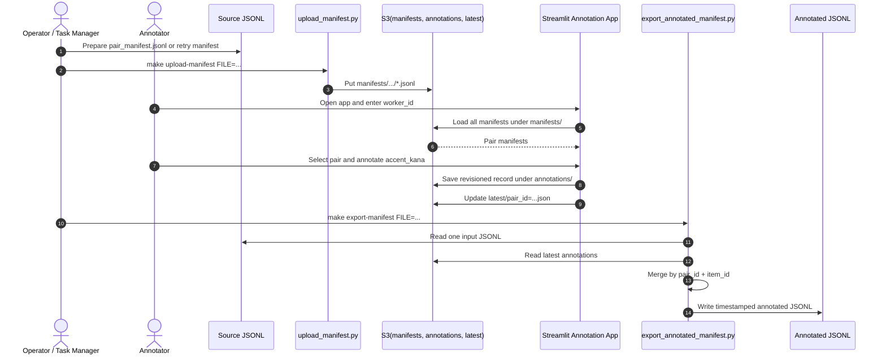
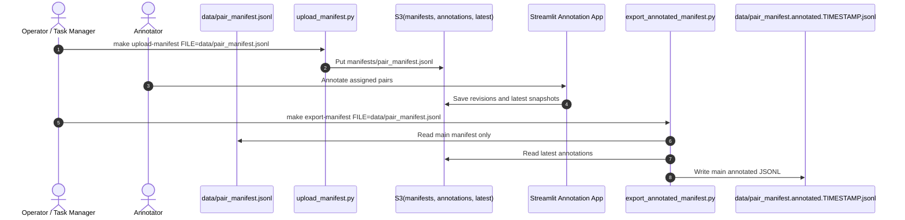
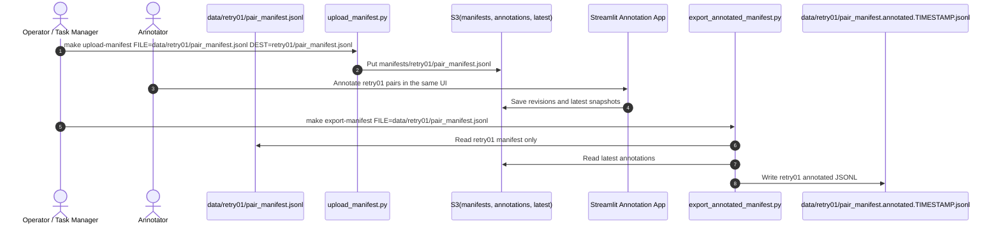

# Pair Annotation App

A standalone annotation application for validating and revising Japanese mishearing stimulus pairs.

This app is intended to be developed in a separate repository from the corpus construction codebase. Its role is to support human annotation over pre-exported pair manifests, with fast audio preview via Amazon Polly and revisioned intermediate annotation storage.

## Goal

Given a `pair_id`, the annotator should be able to:

1. Check whether the 8 sentences belonging to the pair form a valid stimulus set.
2. Reject invalid pairs early when the target words are not used with the same sense.
3. Inspect and revise prosody for valid items.
4. Preview the result with Amazon Polly.
5. Save the final annotation as a pair-level record.

The app is optimized for throughput, not for corpus generation. Data preparation stays in the existing corpus repository; annotation and submission happen in this separate app.

## Responsibility boundary

The responsibility of this app is intentionally narrow.

- Input: pair manifest data derived from `jsonl`
- Main responsibility: provide a UI for pair validity judgment and accent/prosody annotation
- Intermediate output: save revisioned annotation records
- Final corpus update: handled by a separate command that merges annotation records back into `jsonl`

In other words, this app is **not** the place to do corpus generation, bulk S3 result collection, or direct patching of the master corpus inside the interactive UI.

## End-to-end timeline

The operational flow is intentionally split between upload, interactive annotation, and offline export.



When the main manifest and `retry01` are managed as separate deliverables, export them independently.

### Main manifest



### retry01 manifest



## Scope

### In scope

- Reading pair-manifest data derived from `jsonl`
- Pair-level validity screening
- Sentence-level prosody editing for 8 items in a pair
- Amazon Polly preview
- Revisioned intermediate annotation saves
- Worker/time logging for crowdsourcing
- Retrieval of latest revision per pair
- Export-ready annotation records for later merge back into `jsonl`

### Out of scope

- Corpus generation
- Pair mining
- LLM prompting
- Bulk collection and merge of all submitted annotations back into the master corpus inside the UI
- Generation of alternative delivery formats from submitted results
- Audio dataset versioning inside this app repo
- Crowd worker management beyond recording worker IDs and submission logs

## Core assumptions

- One pair contains 8 items.
- Annotators are assigned batches externally, for example via CrowdWorks.
- The app only needs a `worker_id` or equivalent task code.
- Pair validity is decided before detailed prosody correction.
- Prosody editing should be easier than direct AquesTalk/OpenJTalk editing.

## Annotation model

### Pair-level decision

The first decision is whether the pair is usable at all.

A pair is invalid when the two target words are not used with the same sense across the 8 sentences.

Example:

- `めじろ台` is used as a place name
- `目白` is interpreted as the bird

In that case, the pair should be rejected before prosody work begins.

### Sentence-level annotation fields

For valid pairs, each item is edited mainly through a single `accent_kana` field.

`accent_kana` combines reading, accent nucleus, phrase boundaries, pause boundaries, and devoicing markers in one string.

Example:

```json
{
  "accent_kana": "シュウマツニ'/メジロ'ダイニ/デカケタ'",
  "is_natural_sentence": true
}
```

Supported symbols:

- `'`: accent nucleus marker
- `/`: accent phrase boundary without pause
- `、`: pause boundary
- `_`: devoicing marker

Each phrase separated by `/` or `、` must contain exactly one `'`.

## Why this format

The implemented UI favors a single editable `accent_kana` representation because it matches how the current annotation team reviews and corrects prosody.

This keeps the interactive task narrow:

- fix reading when OpenJTalk is wrong
- move the accent nucleus when accent is wrong
- adjust `/` and `、` when phrasing is wrong
- keep a simple preview loop through Polly

## Input data

The app reads pair manifests exported from the corpus repository.

Recommended input unit: one pair per record.

Example:

```json
{
  "pair_id": "めじろ台__目白",
  "word_a": "めじろ台",
  "word_b": "目白",
  "items": [
    {
      "item_id": 17,
      "condition_id": "a",
      "target_word": "めじろ台",
      "sentence": "週末にめじろ台に出かけた。",
      "openjtalk_kana": "シュウマツニ'/メジロ'ダイニ/デカケタ'"
    }
  ]
}
```

## Output data

The UI app writes revisioned intermediate annotations.

Recommended output unit: one annotation record per saved pair revision.

Example:

```json
{
  "pair_id": "めじろ台__目白",
  "worker_id": "cw_001",
  "revision": 3,
  "status": "completed",
  "pair_is_valid": true,
  "pair_invalid_reason": null,
  "started_at": "2026-05-08T10:00:00Z",
  "updated_at": "2026-05-08T10:14:12Z",
  "submitted_at": "2026-05-08T10:14:12Z",
  "elapsed_sec": 852,
  "items": [
    {
      "item_id": 17,
      "condition_id": "a",
      "target_word": "めじろ台",
      "sentence": "週末にめじろ台に出かけた。",
      "is_natural_sentence": true,
      "accent_kana": "シュウマツニ'/メジロ'ダイニ/デカケタ'",
      "preview_used": true,
      "notes": ""
    }
  ]
}
```

These records are intermediate results, not the final corpus file.

The final updated `pair_manifest.jsonl` should be produced by a **separate merge/export command** that:

1. reads the original manifest `jsonl`
2. reads the latest accepted annotation records
3. merges items by the composite key `pair_id + item_id`
4. writes back updated fields such as `corrected_kana`, `corrected`, and `is_natural_sentence`

This separation keeps the interactive annotation app simple and keeps corpus patching reproducible.

Important: `item_id` alone is not assumed to be globally unique across all pair manifests. The merge/export step therefore matches items by `pair_id + item_id`.

Important: the export step reads S3 `latest/` snapshots, so the last saved annotation for each `pair_id` is the one that gets merged.

Only annotations with `status == completed` and `pair_is_valid == true` are reflected back into the output JSONL. Drafts and invalid pairs are ignored during export.

Current helper command:

```bash
uv run python scripts/export_annotated_manifest.py data/pair_manifest.jsonl data/pair_manifest.annotated.jsonl
```

This command reads the original manifest JSONL, fetches latest annotation records from S3, and writes an updated JSONL.

In normal operation, use the `make` target so that the output file name automatically gets a timestamp and the original JSONL is not overwritten.

```bash
make export-manifest FILE=data/pair_manifest.jsonl
make export-manifest FILE=data/retry01/pair_manifest.jsonl
```

After export, copy the generated files into the corpus repository.

```bash
cp data/pair_manifest.annotated.TIMESTAMP.jsonl ~/mishearing-corpus/resource/emnlp2026/
cp data/retry01/pair_manifest.annotated.TIMESTAMP.jsonl ~/mishearing-corpus/resource/emnlp2026/retries/retry01/
```

Example:

```bash
cp data/pair_manifest.annotated.20260511-135458.jsonl ~/mishearing-corpus/resource/emnlp2026/
cp data/retry01/pair_manifest.annotated.20260511-135502.jsonl ~/mishearing-corpus/resource/emnlp2026/retries/retry01/
```

## Validation rules

### Pair-level rules

- All 8 sentences must use the target words in the intended senses.
- If the pair fails this requirement, set `pair_is_valid=false` and stop sentence-level prosody work.

### Sentence-level rules

- Each phrase in `accent_kana` must contain exactly one `'`.
- `/` and `、` are the only supported phrase/pause separators.
- `,` and `，` are invalid; use `、` instead.
- Spaces are invalid in `accent_kana`.
- `_` is allowed in `accent_kana` and should not count as an extra mora.
- Small kana such as `ャ`, `ュ`, `ョ` belong to the previous mora.
- Sokuon `ッ` and moraic nasal `ン` each count as one mora.

## Amazon Polly usage

Amazon Polly is used for preview audio, not as the source of truth.

The app should:

1. Convert `accent_kana` into Polly-compatible SSML.
2. Use Japanese pronunciation support such as `x-amazon-pron-kana` where possible.
3. Insert pauses corresponding to `、`.
4. Synthesize short previews on demand.

Preview is optional support, not the only inspection method.

## Storage design

### S3 layout

Suggested layout:

```text
s3://BUCKET/
  manifests/
    pair_manifest.jsonl
  annotations/
    worker_id=cw_001/
      pair_id=めじろ台__目白/
        rev=0001.json
        rev=0002.json
  latest/
    pair_id=めじろ台__目白.json
```

### Storage strategy

- Keep immutable revision records under `annotations/`
- Optionally write denormalized latest snapshots under `latest/`
- Never overwrite history without retaining revision metadata
- Treat storage here as intermediate annotation storage, not as the canonical final corpus format

## UI requirements

### 0. Pair selection

- Select a `pair_id`
- Show pair metadata and annotation status
- Resume latest revision if one exists

### 1. Pair validity check

- Show all 8 sentences at once
- Ask whether the pair is valid as a stimulus set
- Require a reason when invalid

### 2. Prosody editing

For valid pairs only:

- Display all 8 items, grouped as `a-b`, `c-d`, `e-f`, `g-h`
- Show sentence, target word, and `openjtalk_kana`
- Provide editable `accent_kana`
- Show validation warnings inline

### 3. Save and submit

- Submit completed pair
- Record timestamps and elapsed time
- Keep latest revision retrievable

## Suggested MVP

### Phase 1

- Streamlit app
- Local JSON manifest input
- S3 save
- Pair validity check
- `accent_kana` editing fields
- Basic accent/boundary validation
- Polly preview per sentence

### Phase 2

- Latest revision loading
- Better error messages for mora mismatch
- Worker dashboard
- Search/filter by status
- Batch export for QA

### Phase 3

- Admin review mode
- Inter-annotator agreement support
- Assignment import from external platform output

## Recommended repo structure

```text
annotation-app/
  README.md
  app.py
  requirements.txt
  annotation_app/
    __init__.py
    ui/
    polly/
    validation/
    storage/
    schemas/
  tests/
  docs/
```

## Suggested Python dependencies

- `streamlit`
- `boto3`
- `pydantic`
- `pandas`
- `python-dotenv`
- `pytest`

Optional:

- `orjson`
- `tenacity`
- `mypy`
- `ruff`

## Operational notes

- Worker management is delegated externally, for example to CrowdWorks.
- The app should only store the worker identifier needed for payment and traceability.
- Audio synthesis is helpful but should not be mandatory for every judgment.
- The most important guardrail is strong validation around `accent_kana` symbols, phrasing, and reading quality.

## Open questions

- Exact policy for choosing among multiple submitted revisions when exporting to final corpus JSONL
- Whether export should optionally include invalid-pair decisions in a sidecar report
- Whether latest snapshots should live in S3 only or also in a lightweight DB
- Whether admins need a separate review UI

## Implementation notes (as of 2026-05)

### Export responsibility

The interactive app stores intermediate pair annotations. Final corpus patching is intentionally separate.

Current direction:

- UI app: read manifest-derived JSONL, annotate, save revisioned records
- Export command: fetch latest accepted annotations and write updated JSONL
- Downstream corpus tooling: consume the updated JSONL as needed

This keeps annotation UX and corpus maintenance decoupled.
- A trailing `'` at the end of a phrase (e.g. `イタ'`, `エンシュツオ'`) is stripped from the `ph` attribute. In OpenJTalk notation, a `'` immediately after the last mora of a phrase means flat/0-type accent (no pitch drop). Passing it to Polly would be misinterpreted as a drop at the final mora.
- A mid-phrase `'` (e.g. `ハナ'シテ`) is an accent nucleus marker and is kept.
- The text node inside `<phoneme>` is plain kana with `'`, `_`, and `/` all removed.

Example input: `ハゲシ'イ/エンシュツオ'/フリカエリナ'ガラ、アクションニ/ツ'イテ`

```xml
<speak><lang xml:lang="ja-JP">
  <phoneme alphabet="x-amazon-pron-kana" ph="ハゲシ'イ">ハゲシイ</phoneme>
  <phoneme alphabet="x-amazon-pron-kana" ph="エンシュツオ">エンシュツオ</phoneme>
  <phoneme alphabet="x-amazon-pron-kana" ph="フリカエリナ'ガラ">フリカエリナガラ</phoneme>
  <break time="100ms"/>
  <phoneme alphabet="x-amazon-pron-kana" ph="アクションニ">アクションニ</phoneme>
  <phoneme alphabet="x-amazon-pron-kana" ph="ツ'イテ">ツイテ</phoneme>
</lang></speak>
```

### Tab layout

The app uses four tabs (no step-by-step navigation):

| Tab | Content |
|-----|---------|
| 0. ペア選択 | Worker ID + Pair ID form; annotation history per worker |
| 1. 有効性チェック | Pair validity judgment |
| 2. アクセント編集 | `accent_kana` editing with inline Polly preview |
| 3. 保存・提出 | Draft save and final submission |

### Worker annotation history

Tab 0 shows a table of all annotations submitted by the entered Worker ID.
This list is loaded from `annotations/worker_id={id}/` in S3 and shows pair ID, status, validity judgment, and last updated time.
Clicking a row populates the Pair ID field for easy resumption.

### S3 paths (actual)

```text
s3://BUCKET/{PREFIX}/
  manifests/
    pair_manifest.jsonl          # base batch
    retry01/pair_manifest.jsonl  # additional batches (merged by pair_id)
  annotations/
    worker_id={safe_id}/
      pair_id={safe_id}/
        rev=0001.json
  latest/
    pair_id={safe_id}.json       # latest revision snapshot per pair
```

`safe_id` replaces `/` and `\` with `_`.
